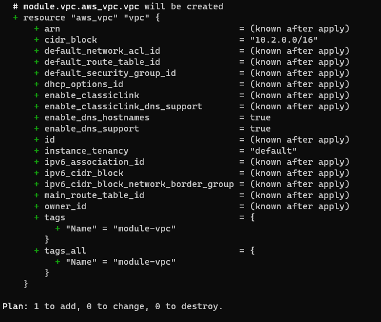
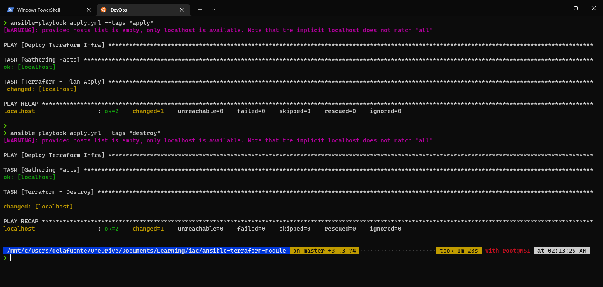
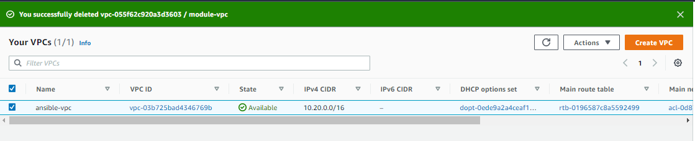

# ansible-terraform-module
POC using ansible to deploy IaC using terraform module

##Test using module (file infra.tf)

##Running ansible using tags, to create or destroy resources

##VPC deployed using Ansible terraform module and variables in the playbook
